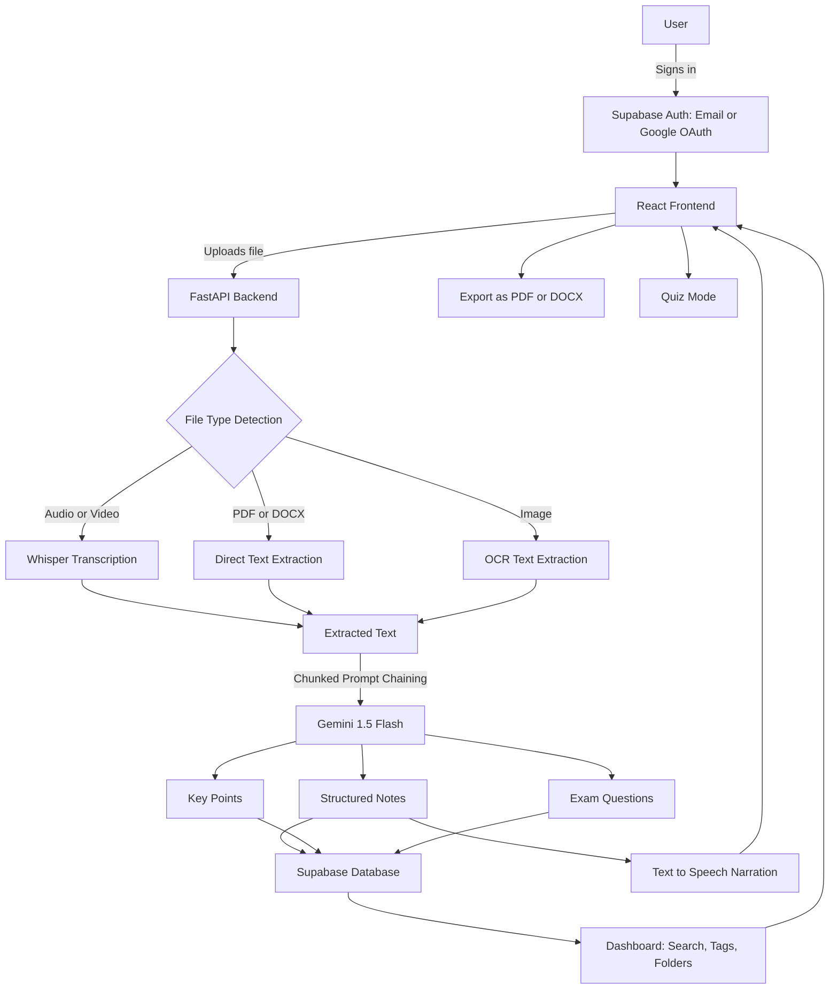

<div align="center">

        
# 𝗡𝗢𝗧𝗜𝗤
 
### 𝘗𝘦𝘳𝘴𝘰𝘯𝘢𝘭𝘪𝘻𝘦𝘥 𝘚𝘵𝘶𝘥𝘺 𝘕𝘰𝘵𝘦𝘴 𝘎𝘦𝘯𝘦𝘳𝘢𝘵𝘰𝘳
 
</div>


<div align="center">


**[Live Application](https://notiq-personalized-study-notes-generator.ai.studio)** &nbsp;|&nbsp; **[Repository](https://github.com/snehalathaArakkonam/NOTIQ)**

</div>

---

## Overview

Notiq is a full-stack web application that converts lecture recordings, documents, and images into structured study notes. A student uploads a lecture audio or video file, a PDF or Word document, or a photograph of handwritten or slide notes, and the system extracts the underlying content, generates a structured summary, highlights key points, produces likely exam questions, and can narrate the summary aloud. Notes are saved to a personal account and organized into a searchable, taggable dashboard.

## Problem Statement

Students frequently miss lectures or fail to take complete, well-organized notes during class. This creates confusion and last-minute panic during exam preparation, particularly when the only available material is an unstructured audio recording or a scanned set of slides with no clear summary of what is important. Existing note-taking tools require the student to already know what matters; they do not synthesize raw lecture content into an exam-ready format.

## Solution

Notiq acts as a synthesis layer between raw lecture material and exam preparation. It accepts multiple input formats, routes each to the correct extraction pipeline, and passes the resulting text through a chunked summarization and prompt-chaining process with a large language model. The output is a consistent, structured note set regardless of whether the original source was spoken, typed, or handwritten, stored persistently against the user's account for later review.

## Core Features

| Feature | Description |
|---|---|
| Multi-format ingestion | Accepts audio, video, PDF, DOCX, and image files through a single upload flow |
| Speech-to-text transcription | Converts lecture audio and video into text using Whisper |
| Structured note generation | Produces headings, key points, and a topic summary using chunked LLM summarization |
| Exam question generation | Generates likely exam questions with answer hints from the transcript |
| Audio narration | Reads the generated notes aloud using text-to-speech, independent of the original input format |
| Authentication | Email and password login plus Google OAuth through Supabase Auth |
| Persistent dashboard | Stores every generated note set against the user's account with search, tags, and folders |
| Export | Downloads notes as a formatted PDF or DOCX file |
| Quiz mode | Converts generated exam questions into an interactive one-at-a-time quiz with scoring |
| Language toggle | Switches the notes output between plain English and a Telugu-English mixed register |

## Architecture


## Screenshots


# and its converts into our favored language


## Tech Stack

| Layer | Technology |
|---|---|
| Frontend Framework | React 18 with Vite and TypeScript |
| Styling | Tailwind CSS with glassmorphism cards over an animated fluid gradient background |
| Frontend Icons | lucide-react |
| File Upload | react-dropzone |
| Backend Framework | FastAPI with Uvicorn |
| Speech-to-Text | Whisper |
| Document Extraction | pdfplumber, python-docx |
| Image OCR | pytesseract |
| Language Model | Google Gemini 1.5 Flash |
| Text-to-Speech | gTTS |
| Authentication | Supabase Auth, email and password, Google OAuth |
| Database | Supabase Postgres |
| Deployment | Google AI Studio |

## Data Structures

Note generation response:

```python
class NoteResponse(BaseModel):
    title: str
    topic_summary: str
    structured_notes: List[NoteSection]
    key_points: List[str]
    exam_questions: List[ExamQuestion]

class NoteSection(BaseModel):
    heading: str
    points: List[str]

class ExamQuestion(BaseModel):
    question: str
    likely_answer_hint: str
```

Stored note set record:

```python
class NoteSetRecord(BaseModel):
    id: str
    user_id: str
    title: str
    tags: List[str]
    folder: Optional[str]
    source_type: Literal["audio", "video", "pdf", "docx", "image"]
    created_at: datetime
    notes: NoteResponse
```

## Sample Input and Output

**Input:** A forty-minute recorded lecture on operating system process scheduling.

**Output:**

```json
{
  "title": "Process Scheduling in Operating Systems",
  "topic_summary": "An overview of CPU scheduling algorithms including FCFS, SJF, and Round Robin.",
  "structured_notes": [
    {
      "heading": "Scheduling Objectives",
      "points": [
        "Maximize CPU utilization and throughput",
        "Minimize waiting time and turnaround time"
      ]
    }
  ],
  "key_points": [
    "Round Robin uses a fixed time quantum for fairness",
    "SJF minimizes average waiting time but can cause starvation"
  ],
  "exam_questions": [
    {
      "question": "Why can Shortest Job First scheduling lead to starvation?",
      "likely_answer_hint": "Longer processes may be repeatedly delayed if shorter processes keep arriving."
    }
  ]
}
```

## Local Setup

Backend:

```bash
cd backend
pip install -r requirements.txt
cp .env.example .env
```

Add the following to `.env`:

```
GEMINI_API_KEY=your_key_here
SUPABASE_URL=your_supabase_project_url
SUPABASE_ANON_KEY=your_supabase_anon_key
```

Start the backend:

```bash
python main.py
```

Frontend:

```bash
cd frontend
npm install
```

Add the following to a `.env` file in the frontend directory:

```
VITE_SUPABASE_URL=your_supabase_project_url
VITE_SUPABASE_ANON_KEY=your_supabase_anon_key
```

Start the frontend:

```bash
npm run dev
```

The frontend runs at `http://localhost:5173` and communicates with the backend at `http://localhost:8000`.

## Deployment

The application is deployed on Google AI Studio and is live at:

[https://notiq-personalized-study-notes-generator.ai.studio](https://notiq-personalized-study-notes-generator.ai.studio)

## Project Structure

```
NOTIQ/
├── backend/
│   ├── main.py
│   ├── requirements.txt
│   └── .env.example
├── frontend/
│   ├── src/
│   │   ├── App.tsx
│   │   ├── components/
│   │   └── index.css
│   ├── tailwind.config.js
│   └── package.json
└── README.md
```

## Future Enhancements

- Support for additional regional languages beyond the Telugu-English mixed output
- Collaborative note sharing between students in the same course
- Automatic flashcard generation from key points
- Offline transcription queue for very large lecture files

## Author

Sneha Latha Arakkonam
B.Tech CSE, AI and ML specialization, Siddartha Institute of Science and Technology
Batch of 2027

GitHub: [snehalathaArakkonam](https://github.com/snehalathaArakkonam)
LinkedIn: [sneha-arakkonam](https://linkedin.com/in/sneha-arakkonam)
Portfolio: [snexpf.netlify.app](https://snexpf.netlify.app)

---
